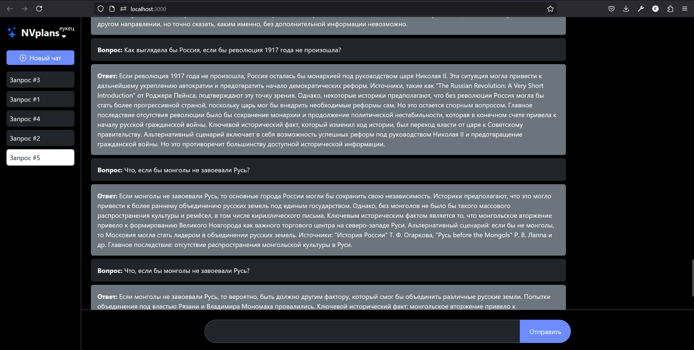
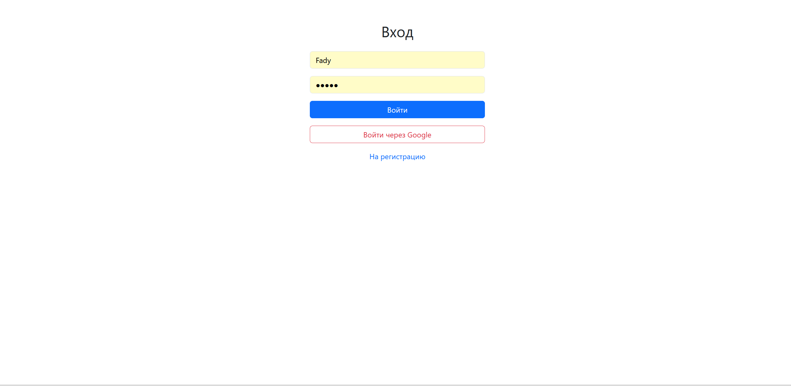

Для запуска проекта смотрите Startguide.md

Альтернативный Историк: чат-бот с LLM для изучения нетрадиционных версий истории.

Описание:
Этот проект представляет собой локально развернутый веб-сервис, предоставляющий пользователю возможность взаимодействовать с LLM (Large Language Model) в формате чат-бота. В отличие от общих LLM, эта модель специально настроена для ответов на вопросы по альтернативной истории. В основе ответов лежат тщательно подобранные и обработанные источники, обеспечивающие связность и убедительность предлагаемых альтернативных исторических сценариев.

Ключевые особенности:

•Локальный запуск: Процесс работы пользовательского интерфейса и сервера запускается локально, но при этом модель находится по ссылке которую можно получить от разработчиков, таким образом модель можно будет очень легко изменить или же перенести на более мощное устройство

•Специализированная LLM: Модель оптимизирована для понимания и генерации текста в контексте альтернативной истории, что позволяет получать более релевантные и интересные ответы, чем при использовании универсальных языковых моделей.

•Опора на источники: Ответы чат-бота подкреплены фактическим материалом и ссылками на источники, обеспечивая доказательную базу для предлагаемых альтернативных версий истории. Это позволяет пользователю не только получить ответ, но и изучить связанные материалы.

•Интуитивно понятный интерфейс: Пользователь взаимодействует с ботом через простой и удобный интерфейс чата, что делает процесс изучения альтернативной истории доступным даже для новичков.

•Возможность расширения и настройки: Проект предоставляет гибкую структуру для добавления новых источников и обучения модели новым альтернативным сценариям.

Внешний вид проекта

Экран входа

